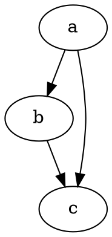

# Test md

::: tip title
content

muliti line
:::

# :star2: Test Markdown


### Graphs

[Link to a Graph](../assets/dot/example.dot "dot:")

::: theorem
Lorem ipsum dolor sit amet, consectetur adipisicing elit. Accusamus obcaecati sunt ad dolorem praesentium nihil impedit velit necessitatibus unde tempora sapiente debitis numquam, reiciendis aut quos officiis deserunt iure fugiat.

::: right
eikipedia
:::




## Definition List

something to explore?
:   Yeah, there is something to be answered


## :100: Latex

$\sqrt{3x-1}+(1+x)^2$

Lift($L$) can be determined by Lift Coefficient ($C_L$) like the following equation.

$$
L = \frac{1}{2} \rho v^2 S C_L
$$

## Component

<Box>
  <template v-slot:header>
    W3<br>CSS
  </template>
  <template v-slot:body>
    <h2>Modern Responsive CSS</h2>
    <p>Equality for all browsers: Chrome. Firefox Edge. IE. Safari. Opera.</p>
    <p>Equality for all devices: Desktop. Laptop. Tablet. Mobile.</p>
    <p>Standard CSS only (No jQuery or JavaScript library).</p>
  </template>
</Box>

## Blockquote

> this is markdown yay!

## COntainers


```py
def abc(self):
    pass
```

Here's a simple footnote,[^1] and here's a longer one.[^bignote]

[^1]: This is the first footnote.

[^bignote]: Here's one with multiple paragraphs and code.

    Indent paragraphs to include them in the footnote.

    `{ my code }`

    Add as many paragraphs as you like.

## Ratings

<Rating :values="['10', '10', '20', '30', '100']" />
