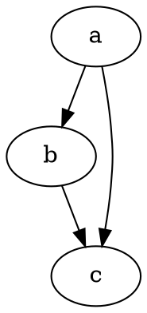

# Test Markdown

<nuxt-link to="/test">
  Test Vue <Page></Page>
</nuxt-link>

> this is markdown yay!

::: tip title
content

muliti line
:::



```py
def abc(self):
    pass
```

Here's a simple footnote,[^1] and here's a longer one.[^bignote]

[^1]: This is the first footnote.

[^bignote]: Here's one with multiple paragraphs and code.

    Indent paragraphs to include them in the footnote.

    `{ my code }`

    Add as many paragraphs as you like.
